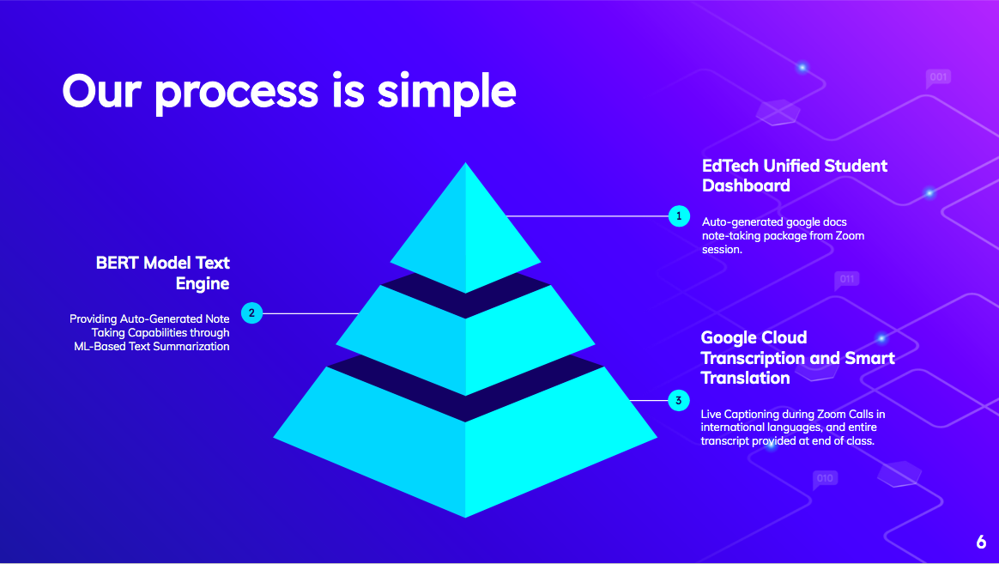
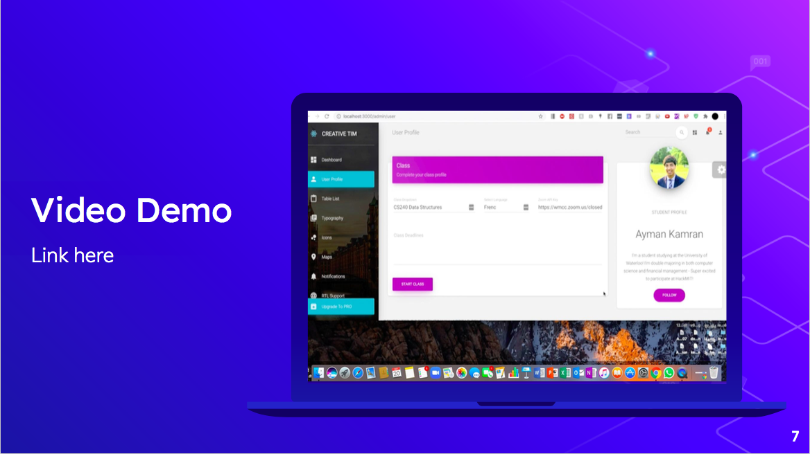
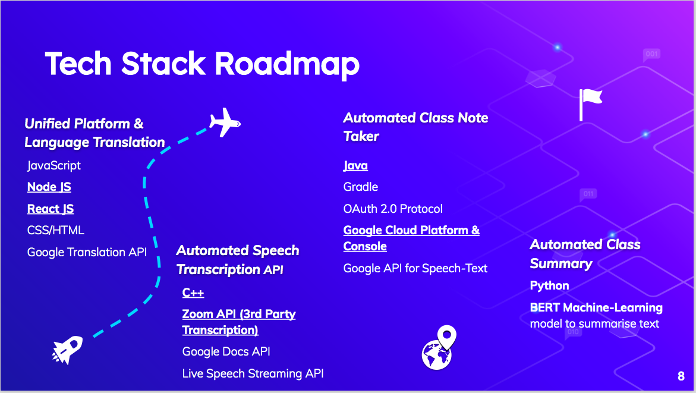

# HackMIT 2020 - Massachussets Institute of Technology's Annual Hackathon
At HackMIT, we built something we call EduCraft.io, an ed-tech streaming platform (like netflix) with various note-taking automations.

# Product Intro

# Our Solution

# Our process

# Live Video Demo - Thumbnail

# Tech Stack Roadmap

# Pitch Deck - These slides were Pitched @HackMIT
https://drive.google.com/file/d/1Ld-yLA5lCy85OtzoF6qP8TvrAs0-T341/view?usp=sharing

# Video Demo - This Video was Shown When Pitching 
Note: This is a silenced video as we spoke over the video during our pitch.
https://drive.google.com/file/d/1OYee1zk7w8ij0sU0ueafNbrx29ysuAPy/view?usp=sharing
